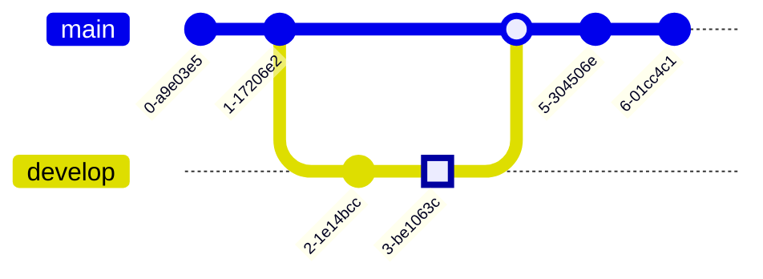

# Mermaid Markdown Diagrams

- [Mermaid on GitHub](https://github.com/mermaid-js/mermaid#readme) 
- [Mermaid docs page](https://mermaid.js.org/intro/)

> _To preview the charts in VS Code you need the extension Markdown Preview Mermaid Support_

## Syntax and examples

Use `mermaid` as the code block language

    ```mermaid
    <!-- code here -->
    ```

Keywords and syntax

1. `TD`, `LR`
1. `%%{``}%%` - for comments
1. `-->`
1. `->>`
1. `-->>`
1. `:`
1. `()`
1. `[]`
1. `{}`
1. `[*]`
1. Diagram Types: graph, gantt, classDiagram, gitGraph, erDiagram, journey, quadrantChart, sequenceDiagram, stateDiagram-v2, pie, requirementDiagram, C4Context, mindmap, timeline, zenuml, sankey-beta, 
1. `end`, participant, loop, Note, right of, dateFormat, title, section, state, as, excludes, click, style, fill, subgraph, class, autonumber, activate, deactivate, 
1. `}|..|{`, `||--o{`, `||--|{`, `[(Database)]`, `((This is the text in the circle))`
1. node-name(Your Text Here)
1. `click` nodename "href"

## Flowchart example

- `flowchart` or use graph, 


- `-->` - used to connect 2 nodes
- `[]` - square corners (default)
- `()` - rectangle node with rounded corners
- `(())` - circle node
- `([])` - pill shaped node
- `{}` - diamond shaped node
- `{{}}` - 6 sided node
- `|Line Label|` - add a label to an arrow line 
- `LR` - chart goes left to right, `TD` chart gors top down, `BT` for bottom to top, nothing is default

## Sequence diagram example


- `autonumber` to number each sequence
- `->>` - used in sequence diagrams to connect nodes
- activate, deactivate

## Class diagram example


- `<<enumeration>>`
- `<<interface>>`
- `-` indicates private
- `+` indicates public 
- `#` indicates protected
- inheritance, composition, and aggregation relationships
- inheritance: class and sub-class relationship - use `<|--`
- composition vs aggregation: special cases of associations 
- use `o--` for aggregation
- use `*--` for composition

## Entity Relationship Diagram example

This is more generic than a class diagram


- use `||--o{`, no
- `|o` means 0 or 1
- `||` exactly 1
- `o{` 0 or more
- `|{` 1 or more
- attributes: 

## Gantt chart


- dateFormat 
- axisFormat
- tickInterval: `/^([1-9][0-9]*)(minute|hour|day|week|month)$/;`
- weekday 
- `%%` = comment

## gitGraph example



- gitGraph
- where are the git hashes coming from?
- commit 
- id, tag, type - `commit id: "your_custom_id"` - `commit id: "Normal" tag: "v1.0.0"`
- branch
- checkout
- merge
- `%%{init: { 'logLevel': 'debug', 'theme': 'base', 'gitGraph': {'showBranches': false}} }%%`
- the page on this is really long...

## Journey diagram


- journey, title, section
- `Task name: <score>: <comma separated list of actors>`

## quadrantChart diagram


- title, 
- x-axis: `x-axis <text> --> <text>` or `x-axis <text>`
- y-axis: `y-axis <text> --> <text>` or `y-axis <text>`
- quadrant-1 - top right, moves counter-clockwise - `quadrant-1 <text>`
- quadrant-2, quadrant-3, quadrant-4
- `<text>: [x, y]` - x and y value is in the range 0 - 1

## Pie chart


- `%%{init: {"pie": {"textPosition": 0.5}, "themeVariables": {"pieOuterStrokeWidth": "5px"}} }%%`

## requirementDiagram

```mermaid

```

- 

## Diagram Types left to do

1. requirementDiagram, 
1. C4Context, 
1. mindmap, 
1. timeline, 
1. zenuml, 
1. stateDiagram-v2, 
1. sankey-beta, 

